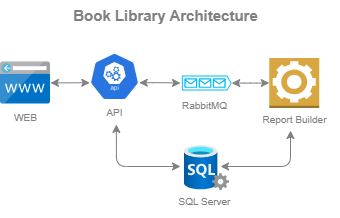

## Book Library

**A sample application that allows users to search for books available in libraries.**

This repository has a microservice solution that will be detailed in the sections ahead, you can try to run in your machine following the [Setup](#setup) steps.

The application is simple as you can see in the diagram below, is composite by an API that queries data from the database and a UI interface for user actions. There is also a dedicated worker for report generation, where communicates with the API using a message broker Service Bus.



## WEB
The user can interact with the application by a Web interface developed using React.js, the source code is available in the folder `book-library-client`.

The app is composed by simple components to search and display the results. Based on title, author, ISBN or category the user can find the books or export a report. 

## API
This repository has an API project located in `book-library-api` that provides endpoints to be consumed by the client. The project follows the Event-Driven Architecture applying concepts of Clean Architecture and is divided in these libraries:
 * **BookLibrary.API**: Exposes endpoints to query and export results.
 * **BookLibrary.Reports**: Consumes Service Bus Queue and generate reports.
 * **BookLibrary.Domain**: Contains the entities and abstractions of the infrastructure.
 * **BookLibrary.Infra**: Implements the infrastructure providing the access to the database.
 * **BookLibrary.Shared**: Have classes shared across applications.

To optimize the performance were created some indexes and applied pagination in the queries. Also, the heavy workloads were separated to be done asynchronously. Some packages were installed to make more easy the implementation the data access layer and queue message handling.
 * **[Dapper](https://www.learndapper.com)**: Simplifies the data access from the database. 
 * **[MassTransit](https://masstransit.io)**: Facilitate working with Service Bus for Event-Driven.

## Setup
### Requirements and Tools
Before begin, you need to have some programs in your machine that will provide the environment to run the apps.
 * .NET Core 8 SDK (.NET CLI)
 * SQL Server (SQL Server Management Studio - SSMS)
 * Service Bus
 * Node.js ^16

### Clone
The first thing you need to do is clone the repository to get the code onto your computer. To do this, you can copy the command below and run it in the terminal.
``` bash
git clone https://github.com/PauloBusch/book-library.git
```

### Setup API
You have to create the database with their respective tables. Get the script [`Setup Database.sql`](book-library-api/src/BookLibrary.Infra/Scripts/Setup%20Database.sql) located in `book-library-api\src\BookLibrary.Infra\Scripts` and execute using SSMS.

In the `appsettings.json` for **BookLibrary.API** and **BookLibrary.Reports** projects you must have to fill these connection strings.
``` json
"ConnectionStrings": {
    "BookLibrary": "FROM_ENV",
    "ServiceBus": "FROM_ENV"
}
```

Then you have to execute the commands below to run the API.
``` bash
cd book-library/book-library-api/src/BookLibrary.API
dotnet run
```

You can check if the API works accessing the documentation in [http://localhost:5262/swagger/index.html](http://localhost:5262/swagger/index.html).

To allow reports generation you have to run the commands bellow to start the worker responsible for it.
``` bash
cd ../BookLibrary.Reports
dotnet run
```

### Setup WEB
Keep the API terminal session open and create a new one in the folder `book-library` to start the client. Run the commands below to install the dependencies and run the app.
``` bash
cd book-library-client
npm install
npm run dev
```

Then you can open the link [http://localhost:5173](http://localhost:5173) to access the app.
